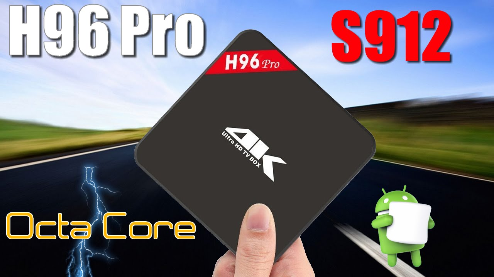
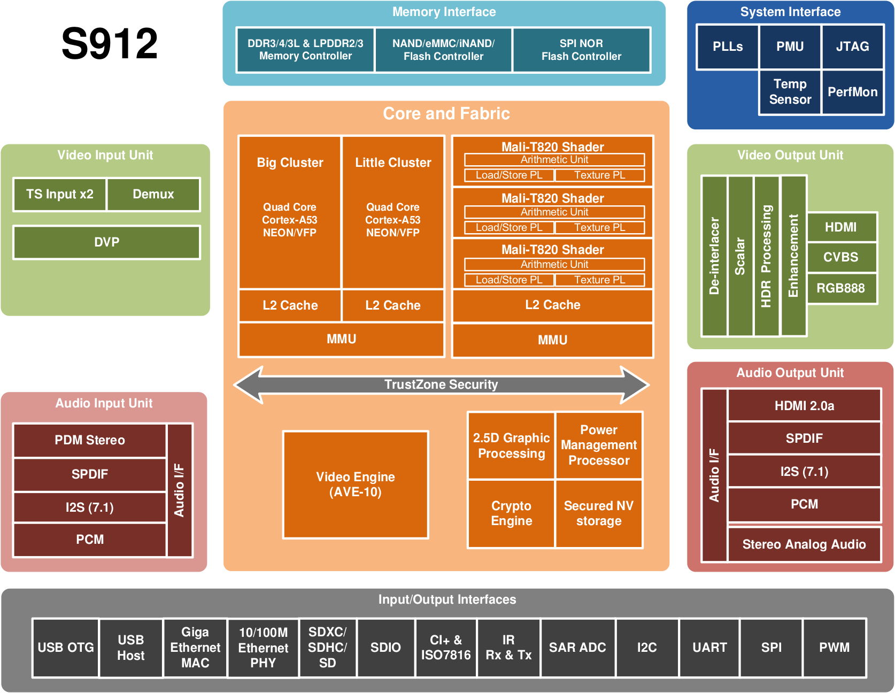

# An Arm based mini cluster

## Introduction

We hereby describe various tools used to setup a small cluster of 4 arm boxes targeting scientific computing applications.

### Hardware

Of course, one does not build a powerful cluster for scientific with low-end hardware, here the project mainly aims at providing a support for learning distributed computing.

One is generally interested to setup a cluster of computer in order to leverage the power of parallel computing. When using the right algorithm, one can enjoy a good scalability with the number of nodes, but it is also interesting to exploit parallel computing within each node.

This is why we chose one of the cheapest computer providing 8 arm core, for a modest price of only 55$ per compute node: the H96 pro + android based TV box, which features the following hardware (from [cnx-software website](http://www.cnx-software.com/2016/04/06/amlogic-s912-processor-specifications/) ):

* CPU Sub-system –  Octa core ARM Cortex-A53 CPU up to 2 GHz (DVFS) with two CPU clusters one optimized for high performance (big) and the other for low power (LITTLE) at 1.5 GHz
* 3D Graphics Processing Unit –ARM Mali-T820MP3 GPU up to 750MHz (DVFS) with 3 shader engines supporting OpenGL ES 1.1/2.03.1, DirectX 11 FL9_3, OpenCL 1.1/1.2 full profile and RenderScript.
* 2.5D Graphics Processor – Fast bitblt engine with dual inputs and single output, programmable raster operations (ROP) and polyphase scaling filter, etc..
* Crypto Engine – AES/AES-XTS block cipher with 128/192/256 bits keys, DES/TDES block cipher, hardware crypto key-ladder operation and DVB-CSA for transport stream encryption,  built-in hardware True Random Number Generator (TRNG), CRC and SHA-1/SHA-2/HMAC SHA engine
* Video/Picture CODEC
  * Amlogic Video Engine (AVE-10) with dedicated hardware decoders and encoders
  * Supports multiple “secured” video decoding sessions and simultaneous decoding and encoding
  * Video/Picture Decoding
    * VP9-10 Profile-2 up to 4Kx2K@60fps
    * H.265 HEVC MP-10@L5.1 up to 4Kx2K@60fps
    * H.264 AVC HP@L5.1 up to 4Kx2K@30fps, H.264 MVC up to 1080p @60fps
    * MPEG-4 ASP@L5 up to 1080P@60fps (ISO-14496)
    * WMV/VC-1 SP/MP/AP up to 1080P@60fps
    * AVS-P16(AVS+) /AVS-P2 JiZhun Profile up to 1080P@60fps
    * MPEG-2 MP/HL up to 1080P@60fps (ISO-13818)
    * MPEG-1 MP/HL up to 1080P@60fps (ISO-11172)
    * RealVideo 8/9/10 up to 1080P@60fps
    * WebM up to VGA
    * MJPEG and JPEG unlimited pixel resolution decoding (ISO/IEC-10918)
    * Supports JPEG thumbnail, scaling, rotation and transition effects
  * Video/Picture Encoding
    * Independent JPEG and H.264 encoder with configurable performance/bit-rate
    * JPEG image encoding
    * H.264 video encoding up to 1080P@60fps with low latency
* Video Post-Processing Engine – Dolby Vision, HDR10 and HLG HDR processing, motion adaptive 3D noise reduction filter, advanced motion adaptive edge enhancing de-interlacing engine, 3:2 pull-down support, deblocking filters, etc..
* Video Output
  * Built-in HDMI 2.0a transmitter including both controller and PHY with 3D, CEC, HDR and HDCP 2.2, 4Kx2K@60 max resolution output
  * CVBS 480i/576i standard definition output
  * RGB888 TTL interface up to 1920×1080
* Camera Interface – ITU 601/656 parallel video input with down-scalar, supports camera input as YUV422, RGB565,16bit RGB or JPEG
* Audio Decoder and Input/Output
  * Supports MP3, AAC, WMA, RM, FLAC, Ogg and programmable with 7.1/5.1 down-mixing
  * I2S audio interface supporting 8-channel (7.1) input and output
  * Built-in serial digital audio SPDIF/IEC958 output and PCM input/output
  * Built-in stereo audio DAC
  * Dual-channel digital microphone PDM input
  * Supports concurrent dual audio stereo channel output with combination of analog+PCM or I2S+PCM
* Memory and Storage Interface
  * 16/32-bit SDRAM memory interface running up to DDR2400
  * Supports up to 2GB DDR3/4, DDR3L, LPDDR2, LPDDR3 with dual ranks
  * Supports SLC/MLC/TLC NAND Flash with 60-bit ECC
  * SDSC/SDHC/SDXC card and SDIO interface with 1-bit and 4-bit data bus width supporting up to UHS-I SDR104
  * eMMC and MMC card interface with 1/4/8-bit data bus width fully supporting spec version 5.0 HS400
  * Supports serial 1, 2 or 4-bit NOR Flash via SPI interface
  * Built-in 4k bits One-Time-Programming memory for key storage (That must be where DRM / HDCP keys are programmed)
* Network
  * Integrated IEEE 802.3 10/100/1000M Gigabit Ethernet MAC controller with RGMII interface
  * Integrated 10/100M PHY interface
  * Supports Energy Efficiency Ethernet (EEE) mode
* Digital Television Interface
  * Transport stream (TS) input interface with built-in demux processor for connecting to external digital TV tuner/demodulator and one output TS interface
  * Built-in PWM, I2C and SPI interfaces to control tuner and demodulator
  * Integrated CI+ port and ISO 7816 smart card controller
* Integrated I/O Controllers and Interfaces
  * 3x USB 2.0 high-speed USB I/O, 2x USB Host and one USB OTG
  * Multiple UART, I2C and SPI interface with slave select
  * Multiple PWMs
  * Programmable IR remote input/output controllers
  * Built-in 10bit SAR ADC with 2 input channels
  * General Purpose IOs with built-in pull up and pull down
* System, Peripherals and Misc. Interfaces
  * Integrated general purpose timers, counters, DMA controllers
  * 24 MHz crystal input
  * Embedded debug interface using ICE/JTAG
* Power Management
  * Multiple external power domains controlled by PMIC, and internal ones controlled by software
  * Multiple sleep modes for CPU, system, DRAM, etc.
  * Multiple internal PLLs for DVFS operation
  * Multi-voltage I/O design for 1.8V and 3.3V
  * Power management auxiliary processor in a dedicated always-on (AO) power domain that can communicate with an external PMIC
* Security
  * Trustzone based Trusted Execution Environment (TEE)
  * Secured boot, encrypted OTP, encrypted DRAM with memory integrity checker, hardware key ladder and internal control buses and storage
  * Protected memory regions and electric fence data partition
  * Hardware based Trusted Video Path (TVP) , video watermarking and secured contents (requires SecureOS software)
  * Secured IO and secured clock
* Package – LFBGA 15 x 15 mm, 0.65 ball pitch, RoHS compliant

Block diagram of the S912 chip:

